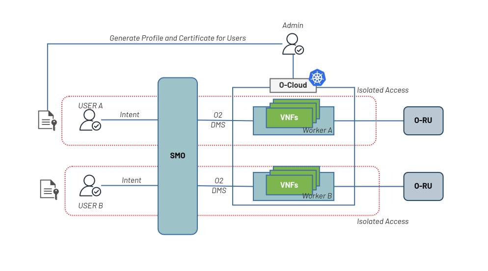

# Kubernetes User Access Provisioning Tool

A simple OCaml-based tool for provisioning Kubernetes users with namespace isolation, worker node restrictions, and cluster-wide viewing permissions. Users receive individual kubeconfig files for secure cluster access.



## What This Does

This tool provisions users in three steps:

1. **Generates certificates** - Creates TLS certificates signed by your cluster's CA
2. **Creates kubeconfig** - Builds a working kubeconfig file for the user
3. **Applies RBAC** - Sets up namespace permissions and cluster viewing rights

If any step fails, everything rolls back automatically.

# Prerequisites

- Kubernetes cluster with admin access
- `ca.crt` and `ca.key` from your cluster
- Admin kubeconfig with cluster-admin privileges
- Docker or Podman with compose

## Directory Structure
```
.
├── main.ml                     # Main OCaml application
├── dune                        # Build configuration
├── dune-project               # Project metadata
├── config.json                # User configuration
├── templates/                 # Kubernetes manifests templates
│   ├── namespace.yaml
│   ├── role.yaml
│   ├── rolebinding.yaml
│   ├── clusterrole.yaml
│   ├── clusterrolebinding.yaml
│   └── kubeconfig.yaml
├── tmp/                       # Place your cluster credentials here
│   ├── ca.crt
│   ├── ca.key
│   └── admin.kubeconfig
├── generated/                 # Output directory for generated files
├── Dockerfile
├── docker-compose.yml
└── README.md
```

## Setup

### 1. Get Cluster Credentials

On your Kubernetes master node:

On your Kubernetes master node:
```bash
# Copy CA certificate and key
sudo cp /etc/kubernetes/pki/ca.crt /tmp/
sudo cp /etc/kubernetes/pki/ca.key /tmp/
sudo chmod 644 /tmp/ca.crt /tmp/ca.key

# Copy admin kubeconfig
sudo cp /etc/kubernetes/admin.conf /tmp/admin.kubeconfig
```

Transfer to your local machine:
```bash
scp master-node:/tmp/ca.crt ./tmp/
scp master-node:/tmp/ca.key ./tmp/
scp master-node:/tmp/admin.kubeconfig ./tmp/
```
### 2. Prepare Output Directory
```bash
mkdir -p generated
chmod 777 generated
```
### 3. Configure User

Edit `config.json`:
```json
{
  "username": "john",
  "email": "john@example.com",
  "namespace": "john-ns",
  "worker_label": "team-a",
  "taint_value": "team-a"
}
```

**Fields:**
- `username` - User identifier
- `email` - Used as CN in certificate
- `namespace` - Dedicated namespace for this user
- `worker_label` - Node selector label (`workload=VALUE`)
- `taint_value` - Taint value for node affinity

### 4. Prepare Worker Nodes

Before provisioning users, administrators must mark worker nodes with appropriate labels and taints to enforce pod placement.

Label the worker nodes:
```bash
kubectl label nodes worker-node-1 workload=team-a
kubectl label nodes worker-node-2 workload=team-a
```

Apply taints to restrict pod scheduling:
```bash
kubectl taint nodes worker-node-1 dedicated=team-a:NoSchedule
kubectl taint nodes worker-node-2 dedicated=team-a:NoSchedule
```

Verify the configuration:
```bash
kubectl describe node worker-node-1 | grep -A5 "Labels\|Taints"
```

Expected output should show:
```bash
Labels:  workload=team-a
Taints:  dedicated=team-a:NoSchedule
```

> Note: The worker_label and taint_value in config.json must match what you set on the nodes. Different teams should use different values (team-a, team-b, etc.) to ensure proper isolation.

To remove taints and labels:
```bash
kubectl taint nodes worker-node-1 dedicated=team-a:NoSchedule-
kubectl label nodes worker-node-1 workload-
```

## Usage

### Provision User
```bash
export UID=$(id -u) GID=$(id -g)
podman-compose build
podman-compose up
```

Or with Docker:
```bash
export UID=$(id -u) GID=$(id -g)
docker-compose build
docker-compose up
```

**Output:**
- `generated/{username}-kubeconfig.yaml` - User's kubeconfig file
- `generated/{namespace}/` - Certificate files
- `generated/manifests/` - Applied Kubernetes manifests

### Revoke User

Remove all resources for a user:
```bash
podman-compose run k8s-provisioner --revoke config.json
```

Or directly:
```bash
export UID=$(id -u) GID=$(id -g)
podman-compose run k8s-revoker
```

## What Gets Created

### 1. Namespace
- Isolated namespace for the user
- Node selector annotation for worker placement

### 2. RBAC Permissions
- **Role** - Full access within assigned namespace
- **RoleBinding** - Binds user to namespace role
- **ClusterRole** - Read-only access to cluster resources (nodes, namespaces, PVs, storage classes)
- **ClusterRoleBinding** - Binds user to cluster viewer role

### 3. Certificates
- Private key (`.key`)
- Certificate signing request (`.csr`)
- Signed certificate (`.crt`)
- Valid for 365 days

### 4. Kubeconfig
- Pre-configured with cluster access
- Default namespace set to user's namespace
- Includes all necessary certificates

## User Instructions

Send the generated kubeconfig to your user:

- Set kubeconfig as default

    ```bash
    # User places the kubeconfig
    mkdir -p ~/.kube
    cp john-kubeconfig.yaml ~/.kube/config
    ```

- Set kubeconfig as environment variable

    ```bash
    # User places the kubeconfig
    export KUBECONFIG=./john-kubeconfig.yaml
    ```


Validate Connection deploy your App
```bash
# Test access
kubectl get nodes
kubectl get namespaces

# Deploy in their namespace
helm install myapp ./chart
```

``

### User Can't Schedule Pods

Ensure worker nodes are properly tainted:
```bash
kubectl taint nodes worker-node-1 dedicated=team-a:NoSchedule
kubectl label nodes worker-node-1 workload=team-a
```

## Configuration Templates

All Kubernetes manifests are in `templates/`. Modify these to change:
- RBAC permissions
- Namespace annotations
- Cluster viewer permissions
- Kubeconfig structure

Variables use `{{VARIABLE_NAME}}` format and are replaced from `config.json`.

## Security Notes

- Keep `ca.key` secure - it can sign certificates for your entire cluster
- Generated certificates are valid for 365 days
- Users have full access within their namespace
- Users can only view (not modify) cluster resources
- All manifests are applied only after certificates succeed

## License

GPL-3.0

## Contributing

Issues and pull requests welcome.


